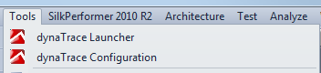
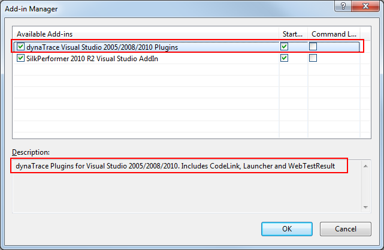
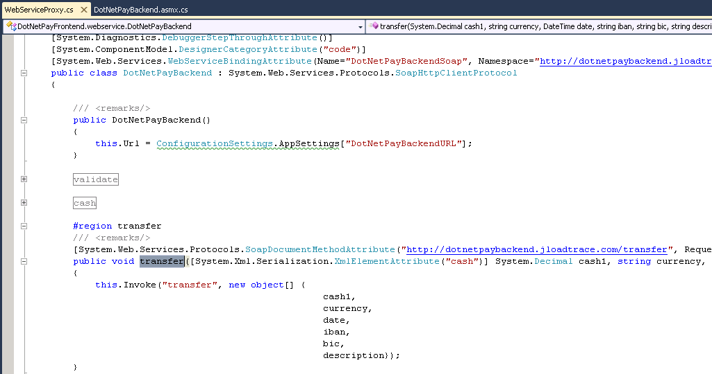
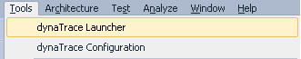
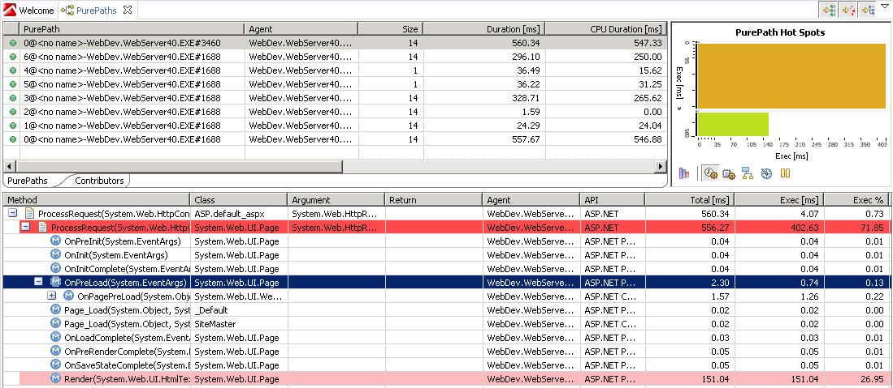
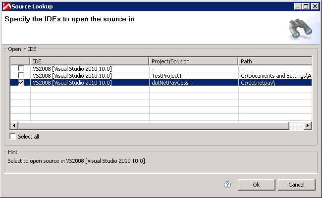
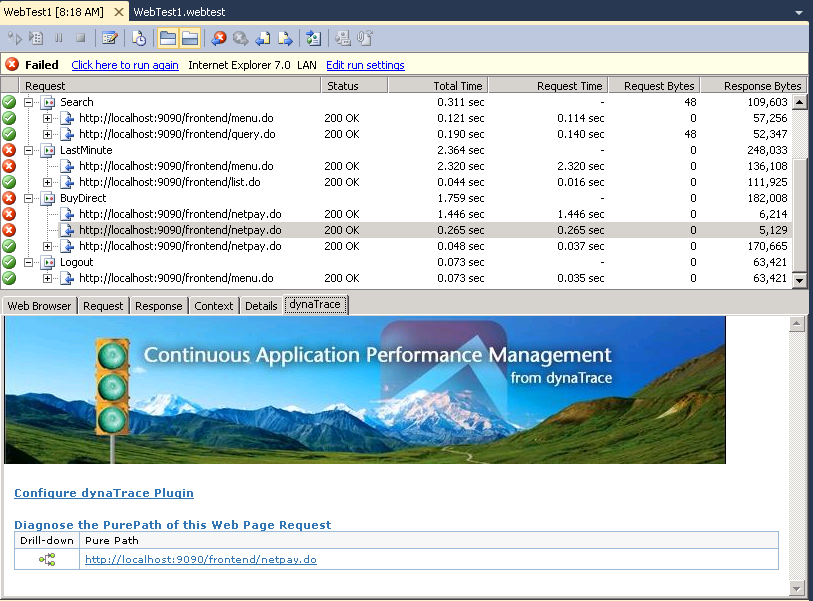
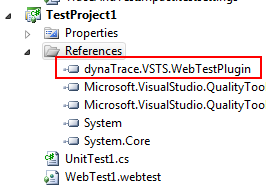
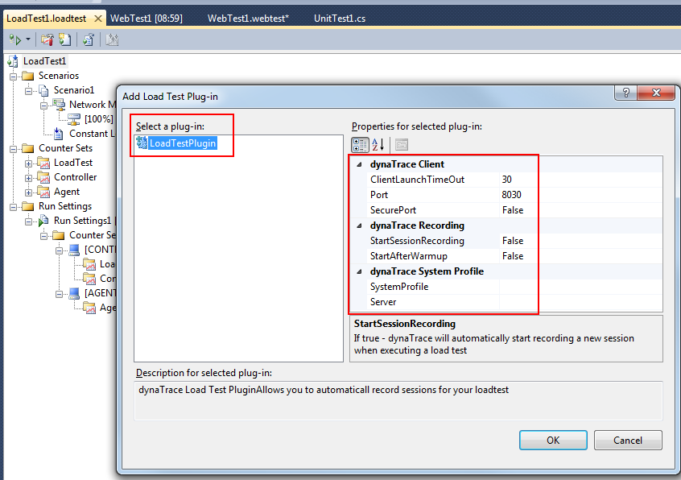
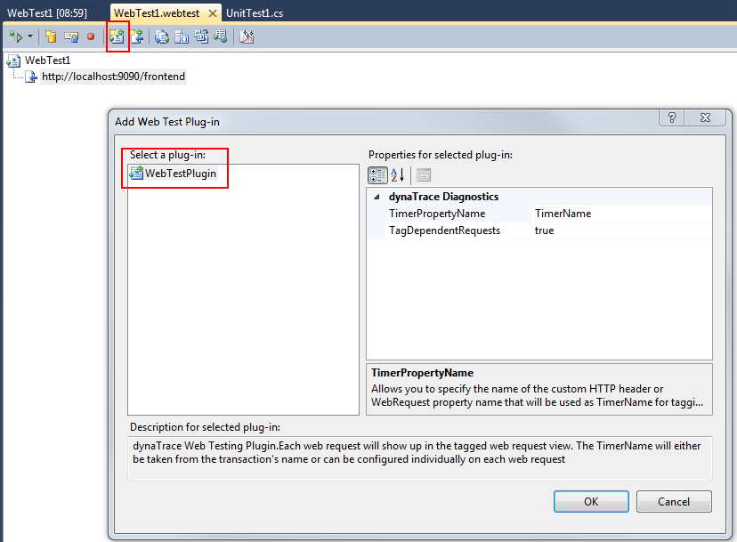

<html xmlns="http://www.w3.org/1999/xhtml">
<head>
    <title>Visual Studio 2010, 2012 and 2013 IDE Plugins</title>
    <meta http-equiv="Content-Type" content="text/html; charset=UTF-8"/>
    <meta http-equiv="X-UA-Compatible" content="IE=EmulateIE8" />
    <meta content="Scroll Wiki Publisher" name="generator"/>
    <link type="text/css" rel="stylesheet" href="css/blueprint/liquid.css" media="screen, projection"/>
    <link type="text/css" rel="stylesheet" href="css/blueprint/print.css" media="print"/>
    <link type="text/css" rel="stylesheet" href="css/content-style.css" media="screen, projection, print"/>
    <link type="text/css" rel="stylesheet" href="css/screen.css" media="screen, projection"/>
    <link type="text/css" rel="stylesheet" href="css/print.css" media="print"/>
</head>
<body>
                <h1>Visual Studio 2010, 2012 and 2013 IDE Plugins</h1>
    

        <h2>Overview</h2>
    

            
            

    

    

This plugin only works if used with <strong class=" ">Visual Studio 2010/2012/2013 Ultimate</strong>! If you're using another edition of Visual Studio 2010/2012/2013, please see <a href="https://community/display/DL/Visual+Studio+2005+and+2008+IDE+Plugins">Visual Studio 2005 and 2008 IDE Plugins</a>.    

    

    

dynaTrace provides plugins for Visual Studio 2010/2012/2013 to enable <strong class=" ">Automatic Code Lookups</strong> from the dynaTrace Client, <strong class=" ">Automatic Agent injection</strong> when launching an application from the IDE, <strong class=" ">Integration</strong> to the Visual Studio <strong class=" ">Load Testing</strong> Feature.    

    

    

        <h2>Plugin Details</h2>
    

        <table>
<thead class=" "></thead><tfoot class=" "></tfoot><tbody class=" ">    <tr>
            <td rowspan="1" colspan="1">
        

Plug-In Versions    

            </td>
                <td rowspan="1" colspan="1">
        

Visual Studio 2010 Plugin (dynaTrace 3.5, 4.x, 5.x, 6.0)    

    

Visual Studio 2012 Plugin (dynaTrace 5.x, 6.0)    

    

Visual Studio 2013 Plugin (dynaTrace 5.6, 6.0)    

            </td>
        </tr>
    <tr>
            <td rowspan="1" colspan="1">
        

Author    

            </td>
                <td rowspan="1" colspan="1">
        

dynaTrace Software    

            </td>
        </tr>
    <tr>
            <td rowspan="1" colspan="1">
        

License    

            </td>
                <td rowspan="1" colspan="1">
        

<a href="attachments_5275722_2_dynaTraceBSD.txt">dynaTrace BSD</a>    

            </td>
        </tr>
    <tr>
            <td rowspan="1" colspan="1">
        

Support    

            </td>
                <td rowspan="1" colspan="1">
        

<a href="https://community/display/DL/Support+Levels">Supported</a>    

            </td>
        </tr>
    <tr>
            <td rowspan="1" colspan="1">
        

Known Problems    

            </td>
                <td rowspan="1" colspan="1">
        

<a href="https://community/display/KB/KB-424+Visual+Studio+Plugin+will+not+work">KB-424 Visual Studio Plugin will not work</a> <a href="https://community.dynatrace.com/community/display/KB/KB-462+Visual+Studio+shows+error+number+80131515+on+startup+when+Add-in+is+activated">KB-462 Visual Studio shows error number 80131515 on startup</a>    

            </td>
        </tr>
    <tr>
            <td rowspan="1" colspan="1">
        

Release History    

            </td>
                <td rowspan="1" colspan="1">
        

2010-04-14 Initial Release    

            </td>
        </tr>
    <tr>
            <td rowspan="1" colspan="1">
        

Release History    

            </td>
                <td rowspan="1" colspan="1">
        

2010-11-02 Release for dynaTrace 3.5    

            </td>
        </tr>
    <tr>
            <td rowspan="1" colspan="1">
        

Plugin Content     
    

            </td>
                <td rowspan="1" colspan="1">
    <ul class=" "><li class=" ">    

<a href="attachments_174751936_1_CodeLinkVS2010.dt60.zip">dynaTrace 6.0 Plugin for Visual Studio 2010/2012/2013</a>    

</li><li class=" ">    

<a href="attachments_174751937_1_dynatrace-vsts.plugin.2010-6.0.0.6733.zip">dynaTrace 6.0 Web and Load Test Plugin for Visual Studio 2010/2012/2013 Load Testing</a>    

</li><li class=" ">    

<a href="attachments_150700086_2_CodeLinkVS2010.dt56.zip">dynaTrace 5.6 Plugin for Visual Studio 2010/2012/2013</a>    

</li><li class=" ">    

<a href="attachments_150700088_1_dynatrace-vsts.plugin.2010-5.6.0.5713.zip">dynaTrace 5.6 Web and Load Test Plugin for Visual Studio 2010/2012/2013 Load Testing</a>    

</li><li class=" ">    

<a href="attachments_121569592_1_CodeLinkVS2010.dt55.zip">dynaTrace 5.5 Plugin for Visual Studio 2010 and 2012</a>    

</li><li class=" ">    

<a href="attachments_121569598_1_dynatrace-vsts.plugin.2010-5.5.0.5226.zip">dynaTrace 5.5 Web and Load Test Plugin for Visual Studio 2010 Load Testing</a>    

</li><li class=" ">    

<a href="attachments_100925537_2_CodeLinkVS2010.dt5.zip">dynaTrace 5 Plugin for Visual Studio 2010 and 2012</a>    

</li><li class=" ">    

<a href="attachments_101482507_2_dynatrace-vsts.plugin.2010-5.0.0.3772.zip">dynaTrace 5 Web and Load Test Plugin for Visual Studio 2010 Load Testing</a>    

</li><li class=" ">    

<a href="attachments_89718918_1_CodeLinkVS2010.dt42.zip">dynaTrace 4.2 Plugin for Visual Studio 2010</a>    

</li><li class=" ">    

<a href="attachments_101482508_1_dynatrace-vsts.plugin.2010-4.2.0.3192.zip">dynaTrace 4.2 Web and Load Test Plugin for Visual Studio 2010 Load Testing</a>    

</li><li class=" ">    

<a href="attachments_67829822_2_CodeLinkVS2010.dt41.zip">dynaTrace 4.1 Plugin for Visual Studio 2010</a>    

</li><li class=" ">    

<a href="attachments_67829821_2_dynatrace-vsts.plugin-4.1.0.2898.zip">dynaTrace 4.1 Web and Load Test Plugin for Visual Studio 2010 Load Testing</a>    

</li><li class=" ">    

<a href="attachments_57638937_3_CodeLinkVS2010.dt4.zip">dynaTrace 4 Plugin for Visual Studio 2010</a>    

</li><li class=" ">    

<a href="attachments_57638935_2_dynatrace-vsts.plugin-4.0.0.2599.zip">dynaTrace 4 Web and Load Test Plugin for Visual Studio 2010 Load Testing</a>    

</li><li class=" ">    

<a href="attachments_47317111_2_CodeLinkVS2010.zip">dynaTrace 3.5 Plugin for Visual Studio 2010</a>    

</li><li class=" ">    

<a href="attachments_47317023_2_dynaTrace.VSTS.WebTestPlugin.dll">dynaTrace 3.5 Web and Load Test Plugin for Visual Studio 2010 Load Testing</a>    

</li></ul>            </td>
        </tr>
    <tr>
            <td rowspan="1" colspan="1">
        

Additional Documentation    

            </td>
                <td rowspan="1" colspan="1">
    <ul class=" "><li class=" ">    

<a href="https://community/display/DOCDT60/Load+Testing+and+Monitoring+Integration">Load Testing and Monitoring Integration</a>    

</li></ul>            </td>
        </tr>
</tbody>        </table>
            

    

    

        <h2>Visual Studio Plugin</h2>
    

        <h3>Installation</h3>
    

All you need to do is to    

<ol class=" "><li class=" ">    

extract the files of the <a href="Visual_Studio_2010,_2012_and_2013_IDE_Plugins.html#47186029_VisualStudio2010%2C2012and2013IDEPlugins-plugindetails">dynaTrace Plugin depending on your dynaTrace version</a> to your <i class=" ">My Documents\Visual Studio 2010\Addins</i> directory. If the <i class=" ">Addins</i> directory does not exist, create it.    

</li><li class=" ">    

Make sure that the downloaded files do not have the &quot;blocked&quot; file attribute under Windows 7. Change that to unblocked    

</li><li class=" ">    

If running Windows XP, after unpacking the files, it might be necessary to change the file protection to RW.  If VS starts with an error related to this plugin, then the protection isn't set generously enough, or the 'blocked' flag is likely set if on Windows 7.    

</li><li class=" ">    

<strong class=" ">Now start Visual Studio as Administrator</strong> - this is required as the dynaTrace plugin requires access to the registry.  (if on Windows XP, simply set all the plugin files to be RW for all users)    

</li><li class=" ">    

The dynaTrace Visual Studio 2010 Plugin can be enabled through <i class=" ">Tools</i>-&gt; <i class=" ">Add-In Manager</i> in Visual Studio.    

</li><li class=" ">    

You need to have installed the dynaTrace .NET agent for launcher to work!!    

</li></ol>    

Note: If VS displays an error when starting and disables the plugin, go back to the steps above and verify the file protection issues listed above.    

    

Once the Add-In is loaded you will see two new menu entries in the Tools menu. One is to configure the dynaTrace Plugin (<i class=" ">dynaTrace Configuration</i>), the other one is to Launch the currently opened project by automatically injecting the dynaTrace .NET Agent into the launched application (<i class=" ">dynaTrace Launcher</i>).    

    

    

        <h3>What the plugin provides</h3>
    

This plugin allows you to <strong class=" ">Lookup Source Code</strong> for a method traced by dynaTrace. From the dynaTrace Client you can select a method in the Methods or PurePath Dashlet and Lookup the method in Visual Studio. <strong class=" ">Please be aware that the code lookup only works for C# Source Code.</strong>    

    

The plugin also allows you to <strong class=" ">launch an application</strong> from the IDE and automatically inject the dynaTrace Agent to trace the launched application.    

    

The plugin also extends the Visual Studio Load Testing Feature with a new tab in the Web Test Result Viewer. When you test a web application and the requests made by Visual Studio return PurePath IDs (by using the Web Test Plugin or by specifying &quot;Always send dynaTrace HTTP Headers&quot; in the ASP.NET Sensor) then you can directly lookup a PurePath from the Result Viewer in Visual Studio    

    

Additional Online Documentation: <a href="Visual_Studio_2010,_2012_and_2013_IDE_Plugins.html">CodeLink AddIn for Visual Studio</a>    

    

    

        <h3>Screenshots</h3>
    

    

    

        <table>
<thead class=" "></thead><tfoot class=" "></tfoot><tbody class=" ">    <tr>
            <td rowspan="1" colspan="1">
        

            
            

            </td>
                <td rowspan="1" colspan="1">
        

            
            

            </td>
                <td rowspan="1" colspan="1">
        

            
            

            </td>
                <td rowspan="1" colspan="1">
        

            
            

            </td>
        </tr>
    <tr>
            <td rowspan="1" colspan="1">
        

Once the dynaTrace Add-On is enabled we get two menu entries in the tools menu    

            </td>
                <td rowspan="1" colspan="1">
        

The dynaTrace Add-On has to be enabled through Tools-&gt;Add-In Manager    

            </td>
                <td rowspan="1" colspan="1">
        

Code of the selected method opened in Visual Studio    

            </td>
                <td rowspan="1" colspan="1">
        

Menu Entry that will launch the current project with injected dynaTrace Agent    

            </td>
        </tr>
    <tr>
            <td rowspan="1" colspan="1">
        

            
            

            </td>
                <td rowspan="1" colspan="1">
        

            
            

            </td>
                <td rowspan="1" colspan="1">
        

            
            

            </td>
                <td rowspan="1" colspan="1">
                </td>
        </tr>
    <tr>
            <td rowspan="1" colspan="1">
        

PurePath that will be captured for every request executed against the launched application    

            </td>
                <td rowspan="1" colspan="1">
        

Lookup the source code of a method from the dynaTrace Client    

            </td>
                <td rowspan="1" colspan="1">
        

The dynaTrace Plugin extends the Web Test Result Viewer    

            </td>
                <td rowspan="1" colspan="1">
                </td>
        </tr>
</tbody>        </table>
            

    

    

    

        <h2>Web and Load Test Plugin</h2>
    

        <h3>Installation</h3>
    

Preconditions    

<ol class=" "><li class=" ">    

dynaTrace Client installed on local machine    

<ul class=" "><li class=" ">    

The plugin drives the session recording via REST calls to the client. The plugin tries to start the client when it is not running    

</li></ul></li><li class=" ">    

Configuration on the dynaTrace Client (connected server / profiles) already done    

<ul class=" "><li class=" ">    

the settings for the plugin will require a server- and profile name to record a session    

</li></ul></li></ol>    

Here are the steps to install this plugin:    

<ol class=" "><li class=" ">    

Download and copy / unzip the <a href="Visual_Studio_2010,_2012_and_2013_IDE_Plugins.html#47186029_VisualStudio2010%2C2012and2013IDEPlugins-plugindetails"> <i class=" ">dynaTrace Web Test Plugin for Visual Studio 2010 Load Testing</i> depending on your dynaTrace version</a> into your Load Testing Project.    

</li><li class=" ">    

Make sure that the downloaded files do not have the &quot;blocked&quot; file attribute under Windows 7. Change that to unblocked    

</li><li class=" ">    

In your project add a reference to copied / unzipped DLL(s).    

</li></ol>    

<strong class=" ">In a Web Test Definition</strong>    

<ul class=" "><li class=" ">    

Click on the &quot;Add Web Test Plugin&quot; toolbar button select the dynaTrace Web Test Plugin.    

</li></ul>    

<strong class=" ">In a Load Test Definition</strong>    

<ul class=" "><li class=" ">    

Add a Load Test Plugin that will enable Start/Stop Session Recording    

</li><li class=" ">    

<strong class=" ">Attention:</strong> the properties &quot;Server&quot; and &quot;SystemProfile&quot; are <i class=" ">case-sensitive</i>! Be sure to use the exact string like shown in the dT-Client.    

</li></ul>    

    

        <h3>What the plugin provides</h3>
    

The Web Test Plugin will automatically tag Web Requests with the dynaTrace HTTP Header. The Load Test Plugin will automatically Start/Stop Session Recording during a load test.    

    

    

        <h3>Screenshots</h3>
    

    

    

        <table>
<thead class=" "></thead><tfoot class=" "></tfoot><tbody class=" ">    <tr>
            <td rowspan="1" colspan="1">
        

            
            

            </td>
                <td rowspan="1" colspan="1">
        

            
            

            </td>
                <td rowspan="1" colspan="1">
        

            
            

            </td>
        </tr>
    <tr>
            <td rowspan="1" colspan="1">
        

Add the reference to dynaTrace.VSTS.WebTestPlugin.dll to your Testing Project    

            </td>
                <td rowspan="1" colspan="1">
        

Enabling dynaTrace as Load Testing Add-On to Start/Stop Session Recording during a Test run    

            </td>
                <td rowspan="1" colspan="1">
        

Enabling dynaTrace Web Test Plugin that will Tag every HTTP Request during a Test run with the dynaTrace HTTP Header    

            </td>
        </tr>
</tbody>        </table>
            

    

    

            

        

        

        

    

</body>
</html>
